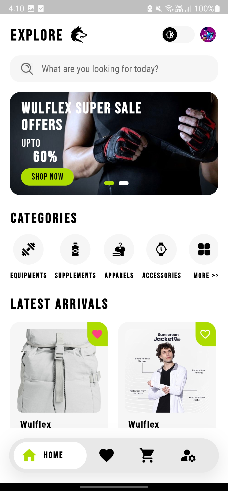
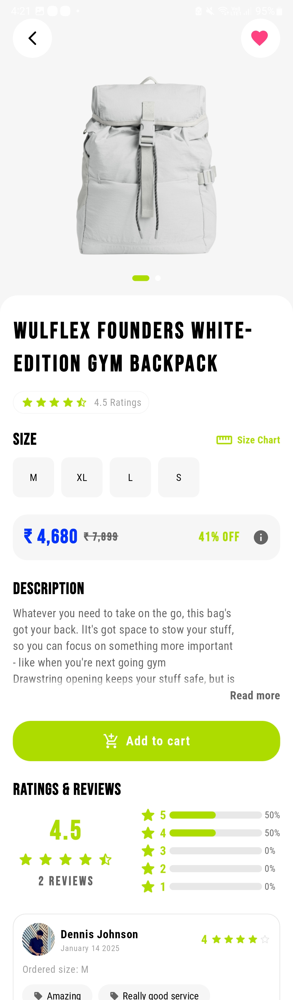
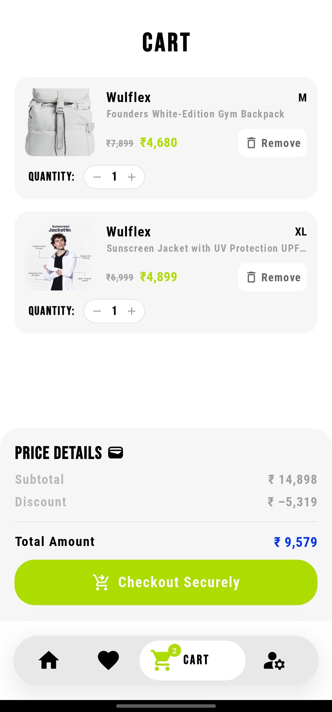

# Wulflex

🚀 **Wulflex: Elevating the Gym Shopping Experience!** 🏋️‍♂️🔥

Wulflex is a **feature-packed eCommerce app** designed for fitness enthusiasts, providing a seamless and intuitive shopping experience for gym-related products. Built with **Flutter, BLoC, Firebase, Razorpay, and FCM**, Wulflex offers a complete ecosystem for users and admins to manage orders, payments, and customer interactions.

## 📌 Key Features
✅ **Shop Products Online** – Browse and purchase gym equipment, apparel, accessories, and supplements.  
✅ **Dark and Light Theme** – Customize your experience with dynamic themes.  
✅ **Real-time Order Updates** – Get instant notifications for every step of your order.  
✅ **Email & Google Login** – Secure and convenient authentication options.  
✅ **Favorite Products** – Save your top picks for later.  
✅ **Add Products to Cart** – Seamlessly add items and checkout with ease.  
✅ **Customer Support** – Live chat support for quick assistance.  
✅ **Profile Management** – Create and manage your profile and saved addresses.  
✅ **Secure Payments** – Integrated with **Razorpay & COD** for flexible transactions.  
✅ **Categories & Product Descriptions** – Explore well-organized product categories with detailed descriptions.  
✅ **Smooth Animations** – Enjoy an engaging UI with fluid animations.  

## 📸 Screenshots
Here are some previews of Wulflex in action:

<p align="center">
   
   
   
</p>

_All screenshots are available in the `screenshots/` folder._

## 📲 Download the App
🔗 **User App:** [Wulflex App](https://www.amazon.com/dp/B0DT47LW78)  
🔗 **Admin Panel:** [Wulflex Admin App](https://www.amazon.com/dp/B0DT1JDCT8)  

## 🛠️ Tech Stack
- **Flutter** – Cross-platform UI framework.
- **Dart** – Programming language.
- **BLoC** – State management for scalable architecture.
- **Firebase** – Backend services including authentication and database.
- **Razorpay** – Secure payment gateway integration.
- **FCM (Firebase Cloud Messaging)** – Real-time notifications.

## 🚀 Installation Guide
1. **Clone the repository**
   ```sh
   git clone https://github.com/codex7Teen/Wulflex_E-commerce_App
   ```
2. **Navigate to the project directory**
   ```sh
   cd wulflex
   ```
3. **Install dependencies**
   ```sh
   flutter pub get
   ```
4. **Run the app**
   ```sh
   flutter run
   ```

## 🤝 Contribution
Contributions are welcome! Feel free to submit a pull request or open an issue.

## 📜 License
This project is licensed under the **MIT License** - see the [LICENSE](LICENSE) file for details.

---
**Author:** Dennis  
📌 **LinkedIn:** [LinkedIn](https://www.linkedin.com/in/dennis-johnson-flutter-developer/)
📌 **GitHub:** [GitHub](https://github.com/codex7Teen)

**Let me know your thoughts and feel free to contribute! 🚀🔥**